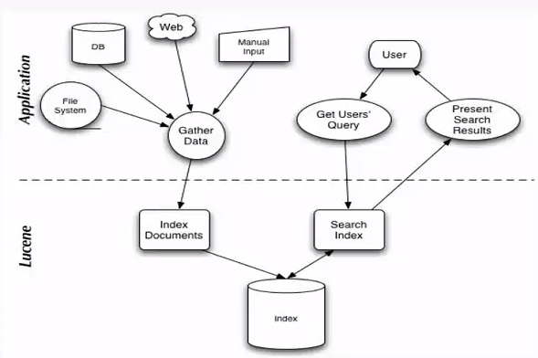
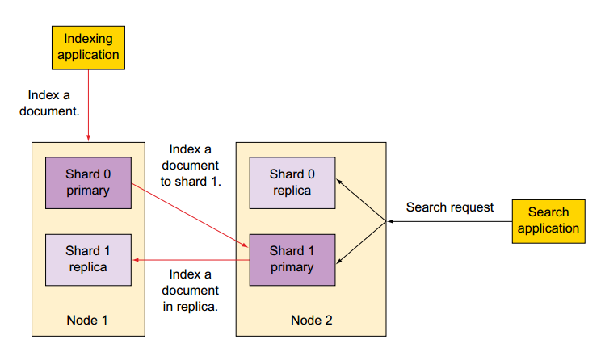

# Basics of Lucene and Elasticsearch


## Lucene

Lucene is a high-performance, scalable information retrieval (IR) library. Lucene was originally written completely in Java by [Doug Cutting](https://en.wikipedia.org/wiki/Doug_Cutting) and can let users add searching capabilities to their applications easily. 

Lucene has been ported to other programming languages including Object Pascal, Perl, C#, C++, Python, Ruby and PHP, so currently it's not only used in Java programs but also the other programming languages.

### How it works?

The architecture of Lucene is very similar to the abstract IR architecture Prof. Caverlee discussed in the class:



It can be divided into two parts: **indexing** and **searching**.

**Indexing**: gathering data (acquiring contents) => building documents => analyzing and indexing documents

**Searching**: building query => searching query in the index library => rendering query results

#### Index Structure

In Lucene, we also use inverted index to index the terms in the documents. But it's quite different. See the structure of the inverted index in lucene as follows:

```
|+ field1(name,type)
    |+ term1
        |+ doc1
          	|+ termFreq = 2
                |+ [position1,offset1,payload1]
                |+ [position2,offset2,payload2]
        |+ doc2
          	|+ termFreq = 1
            		|+ [position3,offset3,payload3]
        |+...
    |+ term2
    |+...
|+ field2(name,type)
|+ ...
```

We can see that there're lots of modifications made on the index structure of Lucene compared to the original inverted index version. 

*   Term: a single term after tokenized and stemmed
*   Field: the collection of Terms
*   Document: the collection of Fields

-   DocIDList: the list of the document IDs
-   TermFreq: term frequency
-   Position: the position information about where a term occurs in the index (after tokenized)
-   Offset: the position information about where a term occurs in the original doc 
-   Payload: additional per-position metadata information such as character offsets and user payloads (e.g. improve the score of a specific term)


### How to use Lucene in Python?

There's a Python version library [PyLucene](http://lucene.apache.org/pylucene/index.html) for accessing Lucene. Here's a [installation instructions](http://lucene.apache.org/pylucene/install.html) introducing how to install PyLucene in your PC.

For convenience, I choose to use docker to run PyLucene on my PC, and below is the docker image I pulled from the docker hub:

```bash
docker pull coady/pylucene
```

Then we can run and enter the docker container:

```bash
docker run -it coady/pylucene /bin/bash
```

And I first collect 10 famous quotes from the Internet and save them as 10 single documents respectively. In each document, the content is some text like below:

>   "Few things in the world are more powerful than a positive push. A smile. A world of optimism and hope. A 'you can do it' when things are tough." ― Richard M. DeVos

Then I will use PyLucene to index all these 10 documents and then search the documents by some queries using PyLucene. Let's see how we can get it.

First, we need to import the required libraries:

```python
import sys, os, lucene, threading, time
from datetime import datetime
import glob
from java.io import File
from java.nio.file import Paths
from org.apache.lucene.analysis.miscellaneous import LimitTokenCountAnalyzer
from org.apache.lucene.analysis.core import WhitespaceAnalyzer
from org.apache.lucene.analysis.standard import StandardAnalyzer
from org.apache.lucene.document import Document, Field, FieldType, TextField
from org.apache.lucene.index import FieldInfo, IndexWriter, IndexWriterConfig, IndexReader, DirectoryReader
from org.apache.lucene.store import SimpleFSDirectory
from org.apache.lucene.util import Version
from org.apache.lucene.analysis.cjk import CJKAnalyzer
from org.apache.lucene.search import IndexSearcher
from org.apache.lucene.queryparser.classic import QueryParser
```

Then we should initialize the Java VM for running Lucene:

```python
# initialize Java VM
lucene.initVM()
```

Later, we can index the documents in the following way:

```python
# define the document(input) directory path and the output index directory path
docdir = "/usr/src/doc"
indir = "/usr/src/index"
DIRTOINDEX = docdir
INDEXIDR = Paths.get(indir)

# initialize analyzer and index writer
indexdir = SimpleFSDirectory(INDEXIDR)
analyzer = StandardAnalyzer()
config = IndexWriterConfig(analyzer)
index_writer = IndexWriter(indexdir, config)

# index the 10 documents in the input directory
for tfile in glob.glob(os.path.join(DIRTOINDEX, '*.txt')):
    print("Indexing: ", tfile)
    document = Document()
    content = open(tfile, 'r').read()
    document.add(Field("text", content, TextField.TYPE_STORED))
    index_writer.addDocument(document)
    print("Done: ", tfile)
    
# show total number of documents and commit the changes
print("\nTotal processed: %s" % index_writer.numRamDocs())
index_writer.commit()
index_writer.close()
```

Analyzer in Lucene is used to analyze text while indexing and searching documents (In other words, Analyzer is used to split the text into tokens). Here we use the `StandardAnalyzer` which will lowercase all words and remove all stopwords and punctuations. 

And here we specify a field called `text` as a `TextField` type which would be indexed, tokenized, stored respectively. (Compared to `StringField` type, which would only be indexed but not tokenized)


After we indexed the documents, we can search some docs in our index library by the queries. For example, we can query the word "success"  in our index library:

```python
# specify the index directory and create the IndexSeacher
INDEXDIR = "/usr/src/index"
indir = Paths.get(INDEXDIR)
indir = SimpleFSDirectory(indir)
ir = DirectoryReader.open(indir)
lucene_searcher = IndexSearcher(ir)
```

```python
query = "text:success"
lucene_analyzer = StandardAnalyzer()
parsed_query = QueryParser(query, lucene_analyzer).parse(query)
hits = lucene_searcher.search(parsed_query, 100)
```

```python
print("Found %d document(s) that matched query '%s':" % (hits.totalHits.value, parsed_query))
for hit in hits.scoreDocs:
    print(hit.toString())
    doc = lucene_searcher.doc(hit.doc)
    print(doc.get("text").encode("utf-8"))
```

We first specify the path of our index library and use `DirectoryReader` to create `IndexReader` and  `IndexSearcher`. Then we can form a query `text:success`: the first partition `text` represents the field name; the second partition `success` represents the content we query. `100` represents the maximum number of documents we would retrieve.


The search result will be sorted by the BM25 score. we can also use the TF-IDF algorithm by manually setting  `indexSearcher.setSimilarity(ClassicSimilarity())`. 


## Elasticsearch

Elasticsearch is a distributed, RESTful search and analytics engine based on the [Lucene](https://en.wikipedia.org/wiki/Lucene) library. Since it packs up search engine operations into RESTful APIs, it's easy and friendly to the users who only know little about search engines. Compared to another full-text search engine [Solr](https://lucene.apache.org/solr/) which is also based on Lucene, it also implements distributed indexing and is the better option for cloud and distributed environments that need good scalability and performance. Besides, Elasticsearch also provides the ability of analyzing big volumes of data in near real-time.

### Basic Concepts

**Index**:  An index is a collection of documents that have somewhat similar characteristics. For example, you can have an index for customer data, another index for a product catalog, and yet another index for order data. An index is identified by a name (that must be all lowercase) and this name is used to refer to the index when performing indexing, search, update, and delete operations against the documents in it.

You can consider Index as the place where Elasticsearch stores data and compare it to the **database** concept in the traditional DBMS like MySQL.


**Type**: A type is a logical category/partition of your index whose semantics is completely up to you. In general, a type is defined for documents that have a set of common fields. For example, let’s assume you run a blogging platform and store all your data in a single index. In this index, you may define a type for user data, another type for blog data, and yet another type for comments data. 

You can consider Type as the structure definition of the data in an index and compare it to the **table** concept in the traditional DBMS like MySQL.


**Document**: A document is a basic unit of information that can be indexed. For example, you can have a document for a single customer, another document for a single product, and yet another for a single order. This document is expressed in [JSON](http://json.org/) (JavaScript Object Notation) which is a ubiquitous internet data interchange format.

You can consider Document as the stored data in Elasticsearch storage and compare it to the **Record** concept in the traditional DBMS like MySQL.


### How to Store Data into Elasticsearch?

Suppose that now we need to store some poems into Elasticsearch. For a poem, it has some basic properties like title, author, number of words and content. We can first create an Elasticseach **index** called `Poems`. Then define a **type** mapping called `Poem`:

```json
{
    "mappings":{
        "poem":{
            "properties":{
                "title":{
                    "type":"keyword"
                },
                "author":{
                    "type":"keyword"
                },
                "numOfWords":{
                    "type":"integer"
                },
                "content":{
                    "type":"text"
                }
            }
        }
    }
}
```

Then we have a **document** of the famous poem "*Sonnet XVIII*" written by William Shakespeare like the following:

```json
{
  "title": "Sonnet XVIII",
  "author": "William Shakespeare",
  "numOfWords": 114,
  "content": "Shall I compare thee to a summer's day?\nThou art more lovely and more temperate:\nRough winds do shake the darling buds of May,\nAnd summer's lease hath all too short a date:\nSometime too hot the eye of heaven shines,\nAnd often is his gold complexion dimm'd;\nAnd every fair from fair sometime declines,\nBy chance, or nature's changing course, untrimm'd;\nBut thy eternal summer shall not fade\nNor lose possession of that fair thou ow'st;\nNor shall Death brag thou wander'st in his shade,\nWhen in eternal lines to time thou grow'st;\nSo long as men can breathe or eyes can see,\nSo long lives this, and this gives life to thee."
}
```

We can see that the entities in ES are represented in JSON (a structure similar to dictionary). Every single **document** JSON represents a record in the **index** `Poems`. The **type** mapping JSON defines the data type of each property and what each property stands for. 

In the **type** mapping, `keyword`, `text` and `integer` are 3 different datatypes of properties. It's similar to the Lucene field type `StringField` and `TextField` we mentioned before. For string datatypes, `text` means this property will be analyzed, tokenized and indexed (see [Text datatype](https://www.elastic.co/guide/en/elasticsearch/reference/5.6/text.html#text)), while `keyword` will not be tokenized and ES will only match its exact value (see [Keyword datatype](https://www.elastic.co/guide/en/elasticsearch/reference/5.6/keyword.html)). There're many other filed datatypes supported by ES (See [Field datatypes](https://www.elastic.co/guide/en/elasticsearch/reference/5.6/mapping-types.html#mapping-types)).


Since we have already prepared all the required data, now we can try to store the data into ES. As we mentioned before, all the APIs are provided in RESTful interfaces in ES, so we can operate ES only by sending HTTP requests.

Create **index** `Poems`:

```bash
$ curl -XPOST 'http://127.0.0.1:9200/poems'

>> {"acknowledged":true,"shards_acknowledged":true,"index":"poems"}
```

Create **type** mapping `Poem`:

```bash
$ curl -XPOST -H "Content-Type: application/json" \
--data '{"poem":{"properties":{"title":{"type":"keyword"},"author":{"type":"keyword"},"numOfWords":{"type":"integer"},"content":{"type":"text"}}}}' \
'http://127.0.0.1:9200/poems/_mapping/poem'

>> {"acknowledged":true}
```

Insert the **document** "*Sonnet XVIII*":

```bash
$ curl -XPOST -H "Content-Type: application/json" \
--data '{"title":"Sonnet XVIII","author":"William Shakespeare","numOfWords":114,"content":"Shall I compare thee to a summer'\''s day?\nThou art more lovely and more temperate:\nRough winds do shake the darling buds of May,\nAnd summer'\''s lease hath all too short a date:\nSometime too hot the eye of heaven shines,\nAnd often is his gold complexion dimm'\''d;\nAnd every fair from fair sometime declines,\nBy chance, or nature'\''s changing course, untrimm'\''d;\nBut thy eternal summer shall not fade\nNor lose possession of that fair thou ow'\''st;\nNor shall Death brag thou wander'\''st in his shade,\nWhen in eternal lines to time thou grow'\''st;\nSo long as men can breathe or eyes can see,\nSo long lives this, and this gives life to thee."}' \
'http://127.0.0.1:9200/poems/poem'

>> {
    "_index":"poems",
    "_type":"poem",
    "_id":"AXCDwBoxQ_YPTVvO9IMP",
    "_version":1,
    "result":"created",
    "_shards":{
        "total":2,
        "successful":1,
        "failed":0
    },
    "created":true
}
```

Here the `id` is generated automatically.

Then we can query this document by the `author` "William Shakespeare":

```bash
$ curl -X GET "127.0.0.1:9200/poems/poem/_search?pretty" \
-H 'Content-Type: application/json' \
--data '{
  "query": {
    "bool": {
      "should": [
        {"match": { "author":  "William" }}
      ]
    }
  }
}'

>>
{
  "took" : 105,
  "timed_out" : false,
  "_shards" : {
    "total" : 5,
    "successful" : 5,
    "skipped" : 0,
    "failed" : 0
  },
  "hits" : {
    "total" : 1,
    "max_score" : 0.2876821,
    "hits" : [
      {
        "_index" : "poems",
        "_type" : "poem",
        "_id" : "AXCDwBoxQ_YPTVvO9IMP",
        "_score" : 0.2876821,
        "_source" : {
          "title" : "Sonnet XVIII",
          "author" : "William Shakespeare",
          "numOfWords" : 114,
          "content" : "Shall I compare thee to a summer's day?\nThou art more lovely and more temperate:\nRough winds do shake the darling buds of May,\nAnd summer's lease hath all too short a date:\nSometime too hot the eye of heaven shines,\nAnd often is his gold complexion dimm'd;\nAnd every fair from fair sometime declines,\nBy chance, or nature's changing course, untrimm'd;\nBut thy eternal summer shall not fade\nNor lose possession of that fair thou ow'st;\nNor shall Death brag thou wander'st in his shade,\nWhen in eternal lines to time thou grow'st;\nSo long as men can breathe or eyes can see,\nSo long lives this, and this gives life to thee."
        }
      }
    ]
  }
}
```

There're many other search approaches. See [Search APIs](https://www.elastic.co/guide/en/elasticsearch/reference/6.8/search.html).

### Python Elasticsearch Examples

We can also use an official client [elasticsearch-py](https://github.com/elastic/elasticsearch-py) to connect Elasticsearch cluster in Python directly.

First, we need to connect to our ES cluster:

```python
from elasticsearch5 import Elasticsearch

es = Elasticsearch([{'host': '127.0.0.1:9200'}])
```


### How Elasticsearch Stores Data Distributedly?

Elasticsearch would first divide the data and each shard of data will have multiple copies. For a shard and its replicas, we have a primary shard and the others are shards replicas. Our write operations will always first be applied to the primary shard, and then the primary shard will copy the new data into other parallel replica shards in background.



In this way, each shard of data for an index is scattered among all nodes in the cluster.


### Use Cases

Elasticsearch has a very fast querying speed, but a relatively slow writing speed due to data merge. And generally, Elasticsearch would cost more memory, storage, CPU resources than HBase and some other NoSQL databases. And sometimes in order to improve the querying speed, we will use SSDs instead of hard drives as the storage for Elasticsearch. Thus it's often more expensive to build up an ES cluster.

The main use cases for Elasticsearch are full-text search systems, ELK log analysis systems, etc. These use scenarios all don't require real-time write performance but require fast query and analysis performance.


## Summary

1.  Lucene is an IR library written in Java based on the idea of the inverted index. It can provide users with plenty of APIs for indexing and searching.
2.  Elasticsearch is a distributed full-text search engine based on Lucene. It can provide users with plenty of RESTful APIs for querying and analyzing.
3.  Compared to Lucene, Elasticsearch doesn't require the users to have much knowledge in Information Retrieval.
4.  The concepts of **index**, **type**, and **document** in Elasticsearch are important. They are similar to the concepts of database, table, and record in RDBMS.
5.  Elasticsearch stores data in a distributed way. Each shard of data will have several paralleled replicas.
6.  Elasticsearch has a good performance in querying, but a relatively slow write speed due to data merge and replication.
7.  A typical application of Elasticsearch is the ELK log analysis system.

## Reference

1.  [Lucene in Action, Second Edition - Manning](https://www.manning.com/books/lucene-in-action-second-edition)
2.  [Lucene Indexing in Liferay Part - 1 : Basic Understanding](http://lifreaystuff.blogspot.com/2015/09/lucene-indexing.html)
3.  [zzboy/lucene](https://github.com/zzboy/lucene)
4.  [Elasticsearch Official Reference](https://www.elastic.co/guide/en/elasticsearch/reference/5.6/index.html)
5.  [终于有人把Elasticsearch原理讲透了！](https://zhuanlan.zhihu.com/p/62892586)
6.  [Elasticsearch Python API Doc](https://elasticsearch-py.readthedocs.io/en/5.5.1/api.html#indices)
7.  [Elasticsearch 5.x Cookbook - Third Edition](https://www.amazon.com/Elasticsearch-5-x-Cookbook-Alberto-Paro/dp/1786465582)

